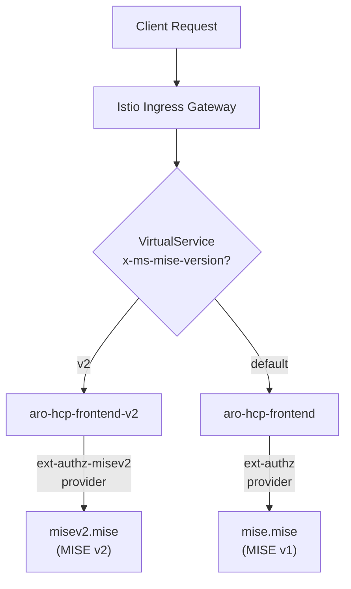

# Whats is MISE?

Microsoft Identity Service Essentials (MISE) is an internal Microsoft service providing:
- Validation of Azure Active Directory (AAD) tokens, including Proof-of-Possession (PoP) tokens and Bearer tokens.
- Authorization based on token claims (appid, roles, scp, etc.), PoP key-binding, and custom policies.
- Integration with Istio external authorizer, enabling token validation at the ingress/service mesh layer.

# Deployment

- MISE is deployed in its own dedicated namespace within the service cluster
- MISE operates as a central authorization service for the RP frontend and other services requiring secure API validation like the Admin API and Backplane API
- mTLS is enforced for communication between Istio components, MISE, and the APIs

# Frontend Authorization Model
- ARM sends an API call with a PoP token:
- Istio external authorizer intercepts the request.
- Istio forwards the request to MISE for validation:
    - Checks PoP token signature, expiration, and claims.
    - Verifies PoP key-binding.
    - Enforces expected audience and app ID.
- MISE returns Allow/Deny (200/403).
- Istio either forwards the request to the RP frontend or rejects it.

# Geneva Action Requests
- Geneva Action sends a request to the Admin API with its AAD token.
- Istio external authorizer intercepts the traffic.
- Istio calls MISE in the service cluster namespace to validate:
    - Token authenticity (issuer, audience, signature, expiration).
    - Expected app ID / service principal identity of Geneva Action.
    - Optional claim validation (e.g., Geneva-specific roles or scopes).
- MISE returns a decision.
- Istio enforces the decision (forward or reject).
Note: This retrofit ensures that Geneva Action traffic is consistently validated through the same MISE-based framework, providing a unified security model for both ARM and Geneva-originated requests.

# MISE v2 Deployment

MISE v2 is deployed alongside v1 as a separate workload in the `mise` namespace. It uses a JSON-based configuration (via ConfigMap) instead of the environment-variable-based configuration used by v1.

## Dual Frontend Routing

Because Istio limits each workload to a single ext-authz provider, and because ext-authz calls bypass VirtualService routing entirely, header-based routing between MISE versions is achieved by running two separate frontend workloads, each with its own AuthorizationPolicy.

### Components

- **Two ext-authz providers** defined in the Istio mesh config (`istio-shared-configmap`):
  - `ext-authz` → `mise.mise.svc.cluster.local:8080`
  - `ext-authz-misev2` → `misev2.mise.svc.cluster.local:8080`
- **Two frontend Deployments and Services**: `aro-hcp-frontend` and `aro-hcp-frontend-v2`, identical except for which ext-authz provider their AuthorizationPolicy references
- **VirtualService on the ingress gateway**: routes requests with `x-ms-mise-version: v2` header to `aro-hcp-frontend-v2`, all other traffic to `aro-hcp-frontend`
- **Shared label** `app.kubernetes.io/part-of: aro-hcp-frontend` on both frontend deployments, used by policies that apply to both (metrics, admin access)

### Why Not VirtualService-Based Routing at the MISE Layer

Istio ext-authz calls bypass VirtualService routing. The Envoy `envoyExtAuthzHttp` filter connects directly to the service cluster endpoints, not through the HTTP routing pipeline. This means a VirtualService on `mise.mise.svc.cluster.local` cannot split ext-authz traffic by header — the split must happen upstream by routing to different frontend workloads, each bound to its own ext-authz provider.
